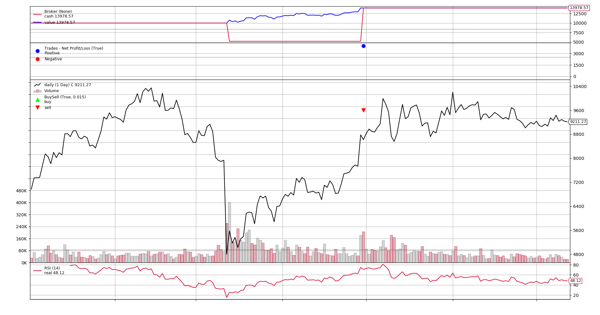
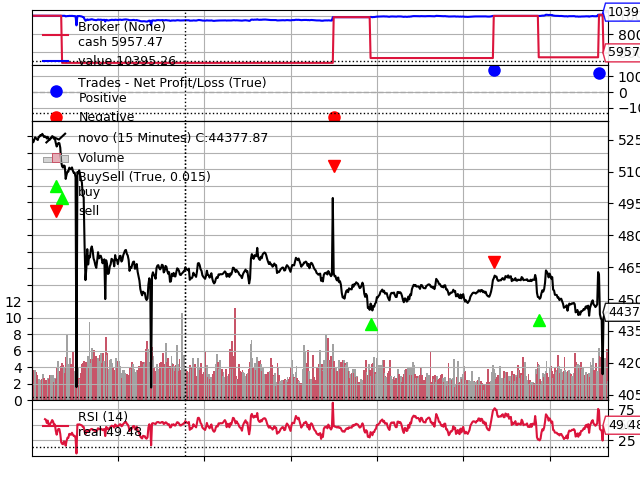

<h1>
  :fire: D.T.A.B  :fire:
</h1>

&nbsp;
<p align="center">
  

   <a href="https://github.com/LeonardoVieira1630/">
    
  </a>
  
   <a href="https://github.com/LeonardoVieira1630/">
    
  </a>
  
  
  
 
</p>

<p align="center">
  <a>Descrição</a>&nbsp;&nbsp;&nbsp;|&nbsp;&nbsp;&nbsp;
  <a>Tecnologias</a>&nbsp;&nbsp;&nbsp;|&nbsp;&nbsp;&nbsp;
  <a>Objetivos</a>&nbsp;&nbsp;&nbsp;|&nbsp;&nbsp;&nbsp;
  <a>Instalação</a>&nbsp;&nbsp;&nbsp;|&nbsp;&nbsp;&nbsp;
  <a>Resultados</a>&nbsp;&nbsp;&nbsp;

</p>

<br>


## :robot: Descrição  

D.T.A.B (Day Trade Asynchronous Bot) é um software desenvolvido em JavaScript para ser capaz de fazer operações de compra e venda de criptomoedas. Alem disso, ele tem autonomia de decisão nas transações pois é capaz de jugar o melhor momento de faze-las.

Para montar a lógica do robô e torna-lo realmente eficiente, levamos em consideração os conceitos apresentados em:

- **The Axioms of Zurich** – Max Gunther.

- **Technical Analysis of the Financial Markets: A Comprehensive Guide to Trading Methods and Applications** - John J. Murphy.

&nbsp;
## :rocket: Tecnologias 

Esse projeto foi desenvolvido com:

- **JavaScript**

- **Python**


Para o perfeito funcionamento do código é necessários os frameworks e bibliotecas a seguir:
- **python-binance**
- **TA-Lib**
- **numpy**
- **websocket**
- **backtrader**
- **Flask**


&nbsp;
## :ghost: Objetivos 

O D.T.A.B foi construído como projeto final da disciplina de Projeto de Eletrônica 1 do curso de Engenharia eletrônica da Universidade federal de Santa Catarina.

A finalidade do projeto era fazer um software totalmente autônomo que gerencie e faça investimento. Para o funcionamento dele, tivemos que estudar e aprender vários tópicos importantes como:

- Funcionamento e uso da Raspberry pi 3.

- Comunicação entre diferentes APIs.

- Conceitos e técnicas de mercado financeiro e criptomoedas.

- Desenvolvimento Web com HTML, CSS e JavaScript.

- Desenvolvimento Back-end em Python.


&nbsp;
## :computer: Instalação 

Para usar o Bot, voce deve clonar esse repositório. Vá até seu terminal e use:
```bash
 git clone https://github.com/Ffquenome/D.T.A.B.git
```
Depois disso, faça o download das dependências usadas ja mencionadas anteriormente.

Agora, você deve criar um arquivo .env com as seguintes informações:
```javaScript
API_URL = 'https://api.binance.com/api'
API_KEY = XXXX
SECRET_KEY = XXXX
```

Por ultimo, é necessário criar uma conta na Binance e pegar seu API_KEY e sua SECRET_KEY. Assim que você tiver essas informações preencha no arquivo .env que criou. Com esses dados, o bot usára sua conta para fazer as transações para você.

Para fazer a conta recomendo seguir esses passos: 

https://www.binance.com/pt-BR/support/faq/360002502072

Et voilà mon ami!! Tudo pronto.


&nbsp;
## :coffee: :ballot_box_with_check: Resultados: 
Com o intuito de validar o funcionamento do Bot e avaliar a seu funcionamento e resultados, usamos o framework Backtrader. Com ele, podemos desenvolver nossa estratégia e testa-la em um determinado periodo de tempo.

Optamos por utilizar uma estratégia basica de compra e venda com o auxilio do indicador financeiro RSI (Indice de força relativa). Ele mede a aceleração do movimento dos preços de determinado ativo e dá suas indicações à medida que o movimento diminui a velocidade, dentro da ideia de que é preciso desacelerar para poder mudar de direção.

Dessa forma, o RSI nos ajuda a identificar se o mercado esta em alta ou baixa e, com base nisso, compramos e vendemos.

A seguir mostraremos alguns dos resultados que obtivemos simulando a estratégia do RSI em diferente periodos de tempo:

- Simulando no periodo de Jan 01 2020 - Jul 12 2020 para o BTCUSDT usando candles de 1 dia:



- Simulando no periodo de Set 07 2021 - Set 13 2021 para o BTCUSDT usando candles de 15 minutos:




Na primeira simulação tivemos um ganho de quase 40% no periodo analisado. Ja na segunda, perdemos quase 40%. Com base nisso, é evidente que para a estratégia ser suficientemente boa para operar no mundo real, devemos fazer uso de mais outros indicadores e não somente o RSI.